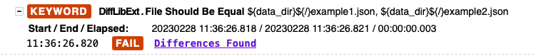
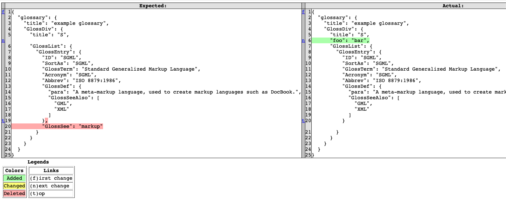

# robotframework-difflibext
Robotframework library to show file/text differences via Python builtin difflib

## Installation
``` shell
pip install --upgrade robotframework-difflibext
```

## Usage
``` robot
*** Settings ***
Library    DiffLibExt

*** Test Cases ***
Text file compare
    File Should Be Equal    ${path_to_file1}    ${path_to_file2}

Large text compare
    Text Should Be Equal    ${text1}    ${text2}

Large dict/list/object compare
    Object Should Be Equal    ${dict1}    ${dict2}
```

## Report Differences
* Differences report link 

* Differences report HTML
